# finetune-gpt-unil

## Introduction

Ce répo a pour but de tester de finetune GPT3.5 sur un dataset de questions/réponses concernant l'université de Lausanne et de voir si le modèle peut répondre à des questions, et si oui, avec quelle qualité. Et aussi tester des questions un peut différente de l'entraienement pour voir si le modèle peut s'adapter à des questions un peut différentes. Et aussi les limtatations du modèle, est ce que il peut dire qu'il ne sait pas répondre à une question, ou est ce qu'il va répondre n'importe quoi.

## Préréquis

- Python 3.8
- environnement virtuel python
- pip
- git
- un compte openai
- un fichier .env avec
  - OPENAI_API_KEY
  - SYSTEM_MESSAGE

## Installation

1. Cloner le répo
2. Créer un environnement virtuel python
   1. faire `python3 -m venv venv` pour créer l'environnement virtuel
   2. activer l'environnement virtuel avec `source venv/bin/activate`
3. Installer les dépendances avec `pip install -r requirements.txt`

## Utilisation

1. Activer l'environnement virtuel avec `source venv/bin/activate`
2. Lancer le script de preparation des questions reponses avec `python prepare_dataset_students.py`
3. Lancer le script de finetune avec `python finetune_gpt.py`
4. Ensuite il est possible de tester le modèle finetuner avec `python test_fineturned_model.py "question"`

## Tests et résultats

### 1. Questions avec plusieurs nombres

Pour commencer j'ai décider de construire les questions depuis un modèle comme ceci :

```python
questions_format_filiere = "Combien y a-t-il d'étudiants en {} pour la filière {} ?"
answers_format_filiere = "Il y a {} femmes, {} hommes et {} étudiants au total en {} pour la filière {}."

questions_format = "Combien y a-t-il d'étudiants en {} ?"
answers_format = "Il y a {} femmes, {} hommes et {} étudiants au total en {} à l'UNIL."
```

Chaque questions contient donc 2 paramètres, le premier est l'année, le deuxième est la filière. Le modèle va donc générer des questions comme ceci :

`Combien y a-t-il d'étudiantes en 2014 pour la filière HEC ?`

Tandis que les réponses seront générées comme ceci :

`Il y a x femmes, y hommes et z étudiants au total en 2014 pour la filière HEC.`

Ensuite j'ai fait un script qui va générer toutes les questions/réponses possibles en se basant sur les données de l'annuaire statistiques 2021-2022 de l'UNIL, qui seront mise sous forme de csv de cette manière :

```csv
annee; femmes; hommes; etranger; CH; total
2011; 1519; 1085; 556; 2048; 2604
2012; 1555; 1170; 626; 2099; 2725
2013; 1645; 1209; 692; 2162; 2854
2014; 1699; 1270; 734; 2235; 2969
2015; 1735; 1288; 750; 2273; 3023
2016; 1911; 1309; 792; 2428; 3220
2017; 1993; 1375; 858; 2510; 3368
2018; 2112; 1369; 869; 2612; 3481
2019; 2250; 1438; 905; 2783; 3688
2020; 2477; 1506; 979; 3004; 3983
2021; 2578; 1530; 1039; 3069; 4108
```

Le script va générer un json de questions/réponses pour chaques fillières qui ressemble a ceci :

```json
{
        "messages": [
            {
                "role": "system",
                "content": "You are an UNIL assistant. Be polite and helpful and answers precisely"
            },
            {
                "role": "user",
                "content": "Combien y a-t-il d'étudiants en 2011 pour la filière FBM ?"
            },
            {
                "role": "assistant",
                "content": "Il y a {} femmes, {} hommes et {} étudiants au total en 2011 pour la filière FBM"
            }
        ]
},
```

La dernière étape avant de finetuner le modèle sera de regrouper tous les jsons de questions/réponses en un seul json, qui dois être sous la forme de jsonl qui est demander par openAI et surtout il doit être sous cette forme :

```json
{
    "messages": [
        {"role": "system", "content": "You are an UNIL assistant. Be polite and helpful and answers precisely"}, 
        {"role": "user", "content": "Combien y a-t-il d'étudiants en 2011 pour la filière FBM ?"}, 
        {"role": "assistant", "content": "Il y a {} femmes, {} hommes et {} étudiants au total en 2011 pour la filière FBM"}
    ]
}
```

Epochs : 3

#### Résultats des questions avec plusieurs nombres

Les résultats ne sont pas bon du tout, le modèle ne comprend les questions et répond avec un format cohérent mais avec des nombres complètement faux.

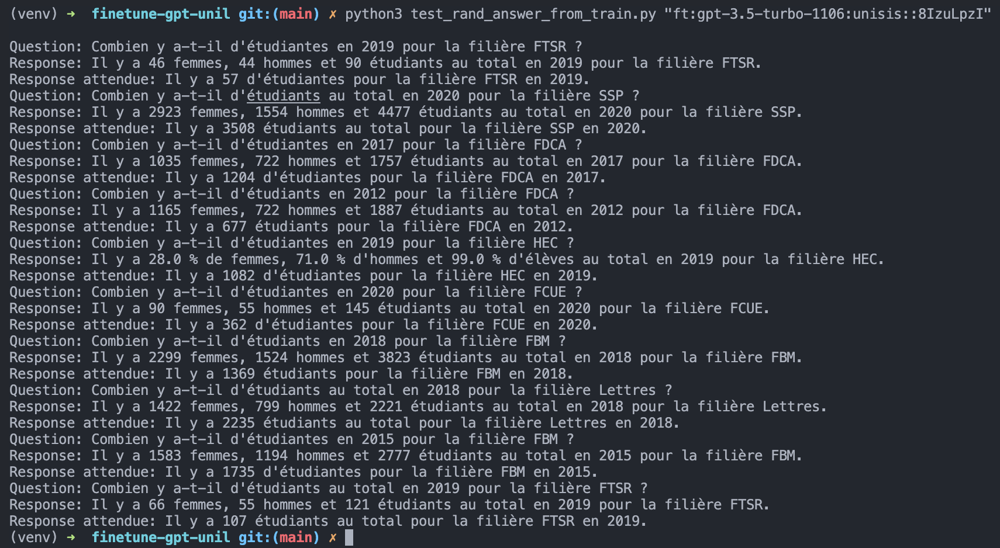

### 2. Questions avec un seul nombre

Pour la deuxième étape j'ai décider de faire des questions avec un seul nombre, comme ceci :

```python
questions_format_filiere = "Combien y a-t-il d'étudiants en {} pour la filière {} ?"
answers_format_filiere = "Il y a {} étudiants en {} pour la filière {}."
```

Nous avons donc une question avec 2 paramètres, l'année et la filière, et une réponse avec 3 paramètres, le nombre d'étudiants, l'année et la filière. Le modèle va donc générer des questions comme ceci :

`Combien y a-t-il d'étudiants en 2014 pour la filière HEC ?`

Du coup les réponses seront générées comme ceci :

`Il y a x étudiants en 2014 pour la filière HEC.`

J'ai réutliser le même script que pour la prépartaion des datasets. Cepandant j'ai aussi fais un script pour tester : `test_precision_model.py` qui va tester les modèles finetuner avec des questions prises aléatoirement dans le dataset de train. Le script va tester le modèle avec x questions(argument --nb_tests) et va calculer la précision du modèle. En comparant les chiffres générés par le modèle avec les chiffres réels. La précision est calculer comme ceci :

```python
def extraire_chiffres(texte):
    return re.findall(r'\b\d+\b', texte)

def evaluer_reponse(response, expected_response):
    chiffres_response = extraire_chiffres(response)
    chiffres_expected = extraire_chiffres(expected_response)
    return chiffres_response == chiffres_expected


def effectuer_un_test(dict_qa, model_id):
    test_results = []
    for question, expected_response in dict_qa.items():
        response = completions(question, model_id)
        chiffres_response = extraire_chiffres(response)
        chiffres_expected = extraire_chiffres(expected_response)
        precision = evaluer_reponse(response, expected_response)
        test_results.append({
            "question": question,
            "response": response,
            "expected_response": expected_response,
            "chiffres_response": chiffres_response,
            "chiffres_expected": chiffres_expected,
            "precision": precision
        })
        if len(test_results) >= args.nb_tests:
            break
    return test_results
```

Et générer un fichier json qui sera sous cette forme :

```json
{
    "model_id": "ft:gpt-3.5-turbo-1106:unisis::8KSSpznh",
    "epochs": 3,
    "precision_moyenne": 15.0,
    "date_heure": "2023-11-27_10-18-00",
    "tests": [
        {
            "question": "Combien y a-t-il d'étudiants en 2020 pour la filière FTSR ?",
            "response": "Il n'y a pas de données pour l'année 2020 pour la filière FTSR. Voulez-vous que je vous donne les informations pour une autre année ?",
            "expected_response": "Il y a 46 étudiants pour la filière FTSR en 2020.",
            "chiffres_response": [
                "2020"
            ],
            "chiffres_expected": [
                "46",
                "2020"
            ],
            "precision": false
        },
        {
            "question": "Combien y a-t-il d'étudiants en 2021 pour la filière FBM ?",
            "response": "Il y a 2029 étudiants pour la filière FBM en 2021.",
            "expected_response": "Il y a 1530 étudiants pour la filière FBM en 2021.",
            "chiffres_response": [
                "2029",
                "2021"
            ],
            "chiffres_expected": [
                "1530",
                "2021"
            ],
            "precision": false
        },
        ...
    ]
}
```

#### Résultats des questions avec un seul nombre

Pour cette partie le but a été de tester la précision du modèle mais nous avons effectué l'entrainement avec le même dataset pour le même modèle cepandant pas avec le même nombres d'itérations.

- 1er test : 3 epochs
- 2ème test : 15 epochs
- 3ème test : 20 epochs
- 4ème test : 25 epochs

A noté que j'ai remarqué rétrospéctivement que le script de test ne fonctionne pas correctement, du coup nous pensions que le modèle était plus précis que ce qu'il est réellement. Et que il y avais potentiellement de l'overfitting.

- 5ème test : 18 epochs

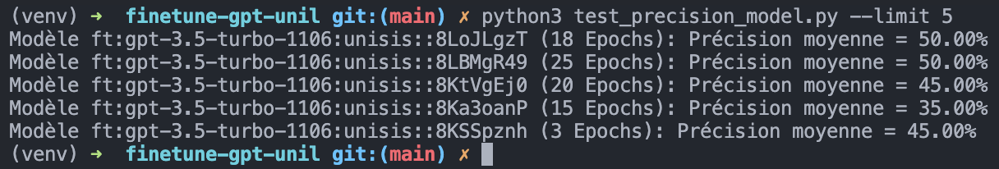

### 3. Questions avec parenthèses autour des nombres

Pour cette partie j'ai décider de faire des questions avec des parenthèses autour des nombres, pour voir si cela peut forcer le modèle à générer les bonnes réponses. Les questions sont comme ceci :

```python
questions_format_filiere_separated = [
    "Combien y a-t-il d'étudiantes en {} pour la filière {} ?",
    "Combien y a-t-il d'étudiants en {} pour la filière {} ?",
    "Combien y a-t-il d'étudiants au total en {} pour la filière {} ?",
]

answers_format_filiere_separated = [
    "Il y a ({}) étudiantes pour la filière {} en {}.",
    "Il y a ({}) étudiants pour la filière {} en {}.",
    "Il y a ({}) étudiants au total pour la filière {} en {}.",
]
```

Pour tester cette méthode j'ai utilisé le même script que pour la partie précédente, et j'ai effectué 2 entrainements :

- 1er entrainement : 25 epochs
- 2ème entrainement : 18 epochs

#### Résultats des questions avec parenthèses autour des nombres

Pour tester cette partie j'ai utilisé le même script que pour la partie précédente, cepandant je voulais faire plusieurs tests donc j'ai fais un script qui fais des subproccess pour lancer plusieurs tests et faire une moyen des précisions. Le script est `test_precision_model_subproccess.py` et il va lancer le script `test_precision_model.py` plusieurs fois et faire une moyenne des précisions. J'ai effectué 10 x 20 tests avec 18 epochs et 10 x 20 tests avec 25 epochs.

Exemple de commande pour lancer le script :

```bash
python3 test_precision_model_subproccess.py --times 10 --results logs/2023-11-27/results_test_parentheses.json --purpose "test de precision  des modèles finetuner avec des parentheses autour des chiffres"
```

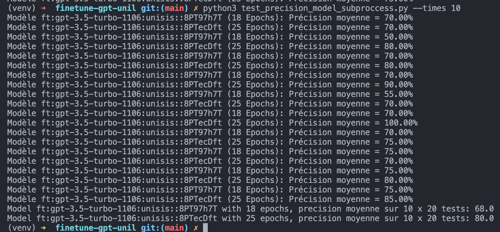

##### V1 json

```json
[
    {
        "model_id": "ft:gpt-3.5-turbo-1106:unisis::8PT97h7T",
        "epochs": 18,
        "precision_moyenne": [
            70.0,
            50.0,
            70.0,
            70.0,
            55.00000000000001,
            70.0,
            70.0,
            75.0,
            75.0,
            75.0
        ]
    },
    {
        "model_id": "ft:gpt-3.5-turbo-1106:unisis::8PTecDft",
        "epochs": 25,
        "precision_moyenne": [
            70.0,
            80.0,
            80.0,
            90.0,
            70.0,
            100.0,
            75.0,
            70.0,
            80.0,
            85.0
        ]
    }
]
```

##### V2 json

```json
[
    {
        "model_id": "ft:gpt-3.5-turbo-1106:unisis::8PT97h7T",
        "epochs": 18,
        "precisions": [
            45.0,
            60.0,
            65.0,
            70.0,
            75.0,
            65.0,
            65.0,
            90.0,
            75.0,
            70.0
        ],
        "precision_moyenne": 68.0
    },
    {
        "model_id": "ft:gpt-3.5-turbo-1106:unisis::8PTecDft",
        "epochs": 25,
        "precisions": [
            80.0,
            80.0,
            80.0,
            80.0,
            80.0,
            75.0,
            80.0,
            80.0,
            95.0,
            75.0
        ],
        "precision_moyenne": 80.5
    },
    {
        "purpose": "test de precision  des modèles finetuner avec des parentheses autour des chiffres",
        "date": "27/11/2023 15:44:48"
    }
]
```

#### Modifications des logs

J'ai ajouter a chaque moyenne le test qui a été effectué pour avoir une meilleur visibilité des résultats.

```json
[
    {
        "model_id": "ft:gpt-3.5-turbo-1106:unisis::8PT97h7T",
        "epochs": 18,
        "files": [
            {
                "file": "logs/2023-11-29/ft:gpt-3.5-turbo-1106:unisis::8PT97h7T/2023-11-29_10-29-00.json",
                "precisions": 15.0
            },
            {
                "file": "logs/2023-11-29/ft:gpt-3.5-turbo-1106:unisis::8PT97h7T/2023-11-29_10-29-22.json",
                "precisions": 5.0
            },
            {
                "file": "logs/2023-11-29/ft:gpt-3.5-turbo-1106:unisis::8PT97h7T/2023-11-29_10-29-44.json",
                "precisions": 10.0
            },
            {
                "file": "logs/2023-11-29/ft:gpt-3.5-turbo-1106:unisis::8PT97h7T/2023-11-29_10-30-07.json",
                "precisions": 15.0
            },
            {
                "file": "logs/2023-11-29/ft:gpt-3.5-turbo-1106:unisis::8PT97h7T/2023-11-29_10-30-27.json",
                "precisions": 10.0
            },
            {
                "file": "logs/2023-11-29/ft:gpt-3.5-turbo-1106:unisis::8PT97h7T/2023-11-29_10-30-49.json",
                "precisions": 25.0
            },
            {
                "file": "logs/2023-11-29/ft:gpt-3.5-turbo-1106:unisis::8PT97h7T/2023-11-29_10-31-09.json",
                "precisions": 20.0
            },
            {
                "file": "logs/2023-11-29/ft:gpt-3.5-turbo-1106:unisis::8PT97h7T/2023-11-29_10-31-30.json",
                "precisions": 15.0
            },
            {
                "file": "logs/2023-11-29/ft:gpt-3.5-turbo-1106:unisis::8PT97h7T/2023-11-29_10-31-51.json",
                "precisions": 15.0
            },
            {
                "file": "logs/2023-11-29/ft:gpt-3.5-turbo-1106:unisis::8PT97h7T/2023-11-29_10-32-13.json",
                "precisions": 15.0
            },
            {
                "file": "logs/2023-11-29/ft:gpt-3.5-turbo-1106:unisis::8PT97h7T/2023-11-29_10-41-38.json",
                "precisions": 10.0
            },
            {
                "file": "logs/2023-11-29/ft:gpt-3.5-turbo-1106:unisis::8PT97h7T/2023-11-29_10-41-59.json",
                "precisions": 5.0
            },
            {
                "file": "logs/2023-11-29/ft:gpt-3.5-turbo-1106:unisis::8PT97h7T/2023-11-29_10-42-20.json",
                "precisions": 15.0
            },
            {
                "file": "logs/2023-11-29/ft:gpt-3.5-turbo-1106:unisis::8PT97h7T/2023-11-29_10-42-41.json",
                "precisions": 10.0
            },
            {
                "file": "logs/2023-11-29/ft:gpt-3.5-turbo-1106:unisis::8PT97h7T/2023-11-29_10-43-02.json",
                "precisions": 15.0
            },
            {
                "file": "logs/2023-11-29/ft:gpt-3.5-turbo-1106:unisis::8PT97h7T/2023-11-29_10-43-23.json",
                "precisions": 5.0
            },
            {
                "file": "logs/2023-11-29/ft:gpt-3.5-turbo-1106:unisis::8PT97h7T/2023-11-29_10-43-45.json",
                "precisions": 10.0
            },
            {
                "file": "logs/2023-11-29/ft:gpt-3.5-turbo-1106:unisis::8PT97h7T/2023-11-29_10-44-06.json",
                "precisions": 15.0
            },
            {
                "file": "logs/2023-11-29/ft:gpt-3.5-turbo-1106:unisis::8PT97h7T/2023-11-29_10-44-26.json",
                "precisions": 10.0
            },
            {
                "file": "logs/2023-11-29/ft:gpt-3.5-turbo-1106:unisis::8PT97h7T/2023-11-29_10-44-47.json",
                "precisions": 15.0
            }
        ],
        "precision_moyenne": 12.75
    },
    {
        "model_id": "ft:gpt-3.5-turbo-1106:unisis::8PTecDft",
        "epochs": 25,
        "files": [
            {
                "file": "logs/2023-11-29/ft:gpt-3.5-turbo-1106:unisis::8PTecDft/2023-11-29_10-29-11.json",
                "precisions": 15.0
            },
            {
                "file": "logs/2023-11-29/ft:gpt-3.5-turbo-1106:unisis::8PTecDft/2023-11-29_10-29-33.json",
                "precisions": 20.0
            },
            {
                "file": "logs/2023-11-29/ft:gpt-3.5-turbo-1106:unisis::8PTecDft/2023-11-29_10-29-55.json",
                "precisions": 15.0
            },
            {
                "file": "logs/2023-11-29/ft:gpt-3.5-turbo-1106:unisis::8PTecDft/2023-11-29_10-30-17.json",
                "precisions": 5.0
            },
            {
                "file": "logs/2023-11-29/ft:gpt-3.5-turbo-1106:unisis::8PTecDft/2023-11-29_10-30-38.json",
                "precisions": 5.0
            },
            {
                "file": "logs/2023-11-29/ft:gpt-3.5-turbo-1106:unisis::8PTecDft/2023-11-29_10-30-59.json",
                "precisions": 10.0
            },
            {
                "file": "logs/2023-11-29/ft:gpt-3.5-turbo-1106:unisis::8PTecDft/2023-11-29_10-31-20.json",
                "precisions": 25.0
            },
            {
                "file": "logs/2023-11-29/ft:gpt-3.5-turbo-1106:unisis::8PTecDft/2023-11-29_10-31-41.json",
                "precisions": 15.0
            },
            {
                "file": "logs/2023-11-29/ft:gpt-3.5-turbo-1106:unisis::8PTecDft/2023-11-29_10-32-02.json",
                "precisions": 5.0
            },
            {
                "file": "logs/2023-11-29/ft:gpt-3.5-turbo-1106:unisis::8PTecDft/2023-11-29_10-32-23.json",
                "precisions": 10.0
            },
            {
                "file": "logs/2023-11-29/ft:gpt-3.5-turbo-1106:unisis::8PTecDft/2023-11-29_10-41-49.json",
                "precisions": 15.0
            },
            {
                "file": "logs/2023-11-29/ft:gpt-3.5-turbo-1106:unisis::8PTecDft/2023-11-29_10-42-09.json",
                "precisions": 5.0
            },
            {
                "file": "logs/2023-11-29/ft:gpt-3.5-turbo-1106:unisis::8PTecDft/2023-11-29_10-42-30.json",
                "precisions": 5.0
            },
            {
                "file": "logs/2023-11-29/ft:gpt-3.5-turbo-1106:unisis::8PTecDft/2023-11-29_10-42-51.json",
                "precisions": 15.0
            },
            {
                "file": "logs/2023-11-29/ft:gpt-3.5-turbo-1106:unisis::8PTecDft/2023-11-29_10-43-13.json",
                "precisions": 15.0
            },
            {
                "file": "logs/2023-11-29/ft:gpt-3.5-turbo-1106:unisis::8PTecDft/2023-11-29_10-43-34.json",
                "precisions": 5.0
            },
            {
                "file": "logs/2023-11-29/ft:gpt-3.5-turbo-1106:unisis::8PTecDft/2023-11-29_10-43-55.json",
                "precisions": 0.0
            },
            {
                "file": "logs/2023-11-29/ft:gpt-3.5-turbo-1106:unisis::8PTecDft/2023-11-29_10-44-16.json",
                "precisions": 0.0
            },
            {
                "file": "logs/2023-11-29/ft:gpt-3.5-turbo-1106:unisis::8PTecDft/2023-11-29_10-44-36.json",
                "precisions": 15.0
            },
            {
                "file": "logs/2023-11-29/ft:gpt-3.5-turbo-1106:unisis::8PTecDft/2023-11-29_10-44-57.json",
                "precisions": 0.0
            }
        ],
        "precision_moyenne": 10.0
    },
    {
        "purpose": "test de precision  des modèles finetuner avec des parentheses autour des chiffres",
        "date": "29/11/2023 10:45:07"
    }
]
```

J'ai réentrainer le modèle avec 25 epochs, ainsi que 30 epochs pour voir si cela améliore les résultats. Mais les résultats sont mauvais.

J'ai quand même re fait des tests avec le script `test_precision_model_subproccess.py` mais avec 20 itérations de 20 questions, voici les résultats :

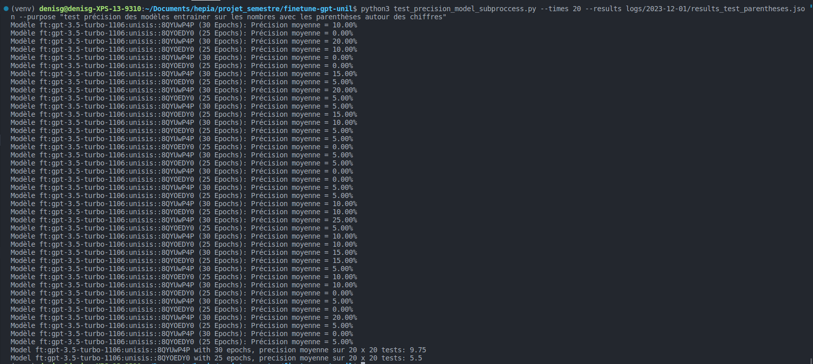

J'ai ensuite re fait des tests avec le script `test_precision_model_subproccess.py` mais avec 10 itérations de 20 questions, voici les résultats :

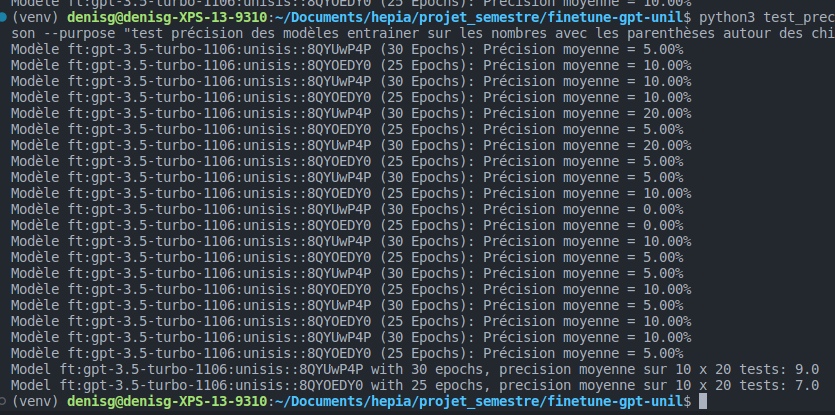

### 4. Questions avec un $ devant les nombres

Pour cette partie j'ai décider de faire des questions avec un $ devant les nombres, pour voir si cela peut forcer le modèle à générer les bonnes réponses. Les questions sont comme ceci :

```python
questions_format_filiere_separated = [
    "Combien y a-t-il d'étudiantes en {} pour la filière {} ?",
    "Combien y a-t-il d'étudiants en {} pour la filière {} ?",
    "Combien y a-t-il d'étudiants au total en {} pour la filière {} ?",
]

answers_format_filiere_separated = [
    "Il y a ${} étudiantes pour la filière {} en {}.",
    "Il y a ${} étudiants pour la filière {} en {}.",
    "Il y a ${} étudiants au total pour la filière {} en {}.",
]
```

Concernant le message du système j'ai décider de le changer pour voir si cela peut améliorer les résultats :

```Tu es un data scientist. On te présente des données concernant les étudiants inscrits au semestre d’automne, par faculté selon le sexe. Les valeurs statistiques sont précedées d'un $.```

Pour tester cette méthode j'ai utilisé le même script que pour la partie précédente, et j'ai effectué 2 entrainements :

- 1er entrainement : 25 epochs `ft:gpt-3.5-turbo-1106:unisis::8R1oML8b`
- 2ème entrainement : 18 epochs `ft:gpt-3.5-turbo-1106:unisis::8R1lzDYW`

#### Résultats des questions avec un $ devant les nombres

Pour tester cette partie j'ai utilisé le même script que pour la partie précédente, j'ai effectué 10 x 20 tests avec 18 epochs et 10 x 20 tests avec 25 epochs.

Exemple de commande pour lancer le script :

```bash
python3 test_precision_model_subproccess.py --times 10 --results logs/2023-12-01/results_test_dollar.json --purpose "test de precision des modèles finetuner avec un $ devant les chiffres"
```

10 x 20 tests avec 25 epochs pour le modèle `ft:gpt-3.5-turbo-1106:unisis::8R1oML8b`
10 x 20 tests avec 18 epochs pour le modèle `ft:gpt-3.5-turbo-1106:unisis::8R1lzDYW`

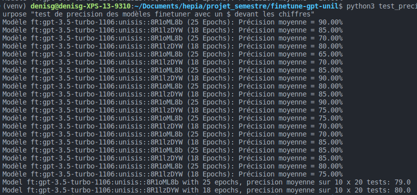

20 x 20 tests avec 25 epochs pour le modèle `ft:gpt-3.5-turbo-1106:unisis::8R1oML8b`
20 x 20 tests avec 18 epochs pour le modèle `ft:gpt-3.5-turbo-1106:unisis::8R1lzDYW`

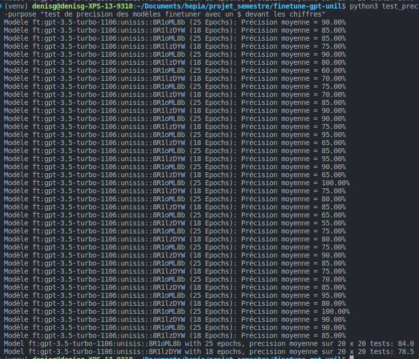

20 x 20 tests avec 25 epochs pour le modèle `ft:gpt-3.5-turbo-1106:unisis::8R1oML8b`
20 x 20 tests avec 18 epochs pour le modèle `ft:gpt-3.5-turbo-1106:unisis::8R1lzDYW`

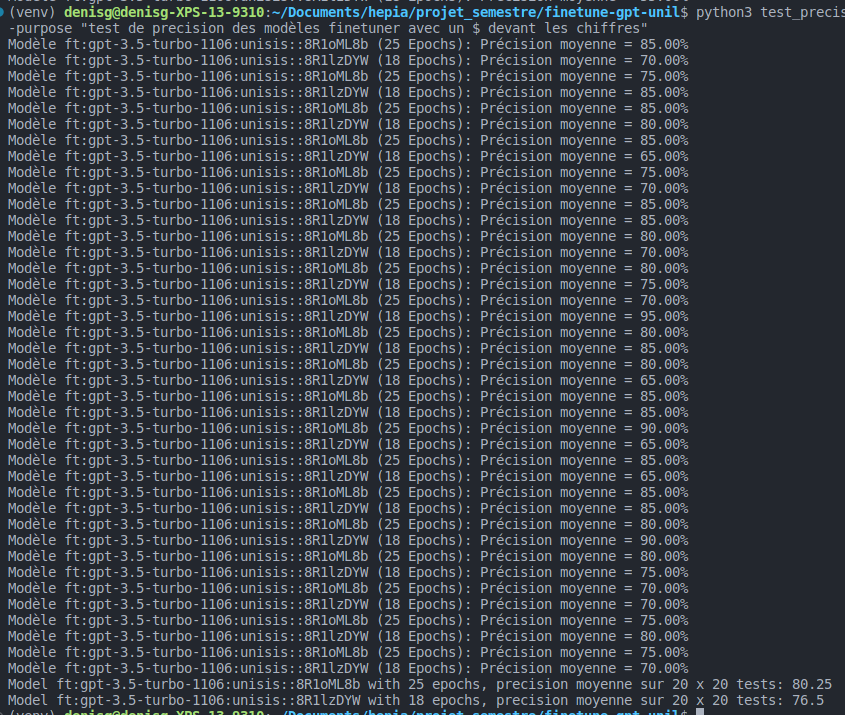

##### Moyenne des précisions sur 1000 questions

- 25 : 81.08
- 18 : 78.33

Nous pouvons remarquer que le modèle `ft:gpt-3.5-turbo-1106:unisis::8R1oML8b`

### 5. Seconds tests avec des parenthèses autour des nombres

Ce test est une répétition du test 3, cepandant je vais changer le système message pour voir si cela peut améliorer les résultats.

```Tu es un data scientist. On te présente des données concernant les étudiants inscrits au semestre d’automne, par faculté selon le sexe. Les valeurs statistiques sont entre parenthèses.```

Pour tester cette méthode j'ai utilisé le même script que pour la partie précédente, et j'ai effectué 3 entrainements :

- 1er entrainement : 25 epochs `ft:gpt-3.5-turbo-1106:unisis::8R3ZZw2r`
- 2ème entrainement : 18 epochs `ft:gpt-3.5-turbo-1106:unisis::8R3kyRKk`
- 3ème entrainement : 30 epochs `ft:gpt-3.5-turbo-1106:unisis::8R3kfrtr`

#### Résultats des seconds tests avec des parenthèses autour des nombres

Pour tester cette partie j'ai utilisé le même script que pour la partie précédente, j'ai effectué 10 x 20 tests avec 18 epochs et 10 x 20 tests avec 25 epochs. Et j'ai aussi effectué 10 x 20 tests avec 30 epochs.

Exemple de commande pour lancer le script :

```bash
python3 test_precision_model_subproccess.py --limit 3 --times 10 --results logs/2023-12-01/results_test_parentheses_3.json --purpose "test de precision des modèles finetuner avec des parentheses autour des chiffres" --system_message "Tu es un data scientist. On te présente des données concernant les étudiants inscrits au semestre d’automne, par faculté selon le sexe. Les valeurs statistiques sont entre parenthèses."
```

10 x 20 tests avec 25 epochs pour le modèle `ft:gpt-3.5-turbo-1106:unisis::8R3ZZw2r`
10 x 20 tests avec 18 epochs pour le modèle `ft:gpt-3.5-turbo-1106:unisis::8R3kyRKk`
10 x 20 tests avec 30 epochs pour le modèle `ft:gpt-3.5-turbo-1106:unisis::8R3kfrtr`

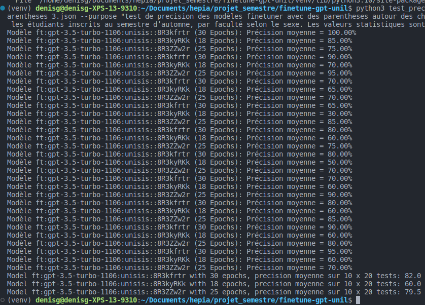

20 x 20 tests avec 25 epochs pour le modèle `ft:gpt-3.5-turbo-1106:unisis::8R3ZZw2r`
20 x 20 tests avec 18 epochs pour le modèle `ft:gpt-3.5-turbo-1106:unisis::8R3kyRKk`
20 x 20 tests avec 30 epochs pour le modèle `ft:gpt-3.5-turbo-1106:unisis::8R3kfrtr`

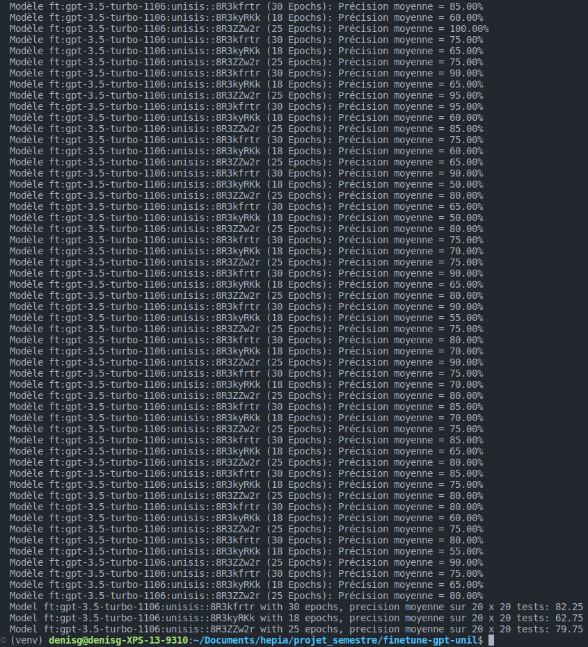

30 x 20 tests avec 25 epochs pour le modèle `ft:gpt-3.5-turbo-1106:unisis::8R3ZZw2r`
30 x 20 tests avec 18 epochs pour le modèle `ft:gpt-3.5-turbo-1106:unisis::8R3kyRKk`
30 x 20 tests avec 30 epochs pour le modèle `ft:gpt-3.5-turbo-1106:unisis::8R3kfrtr`

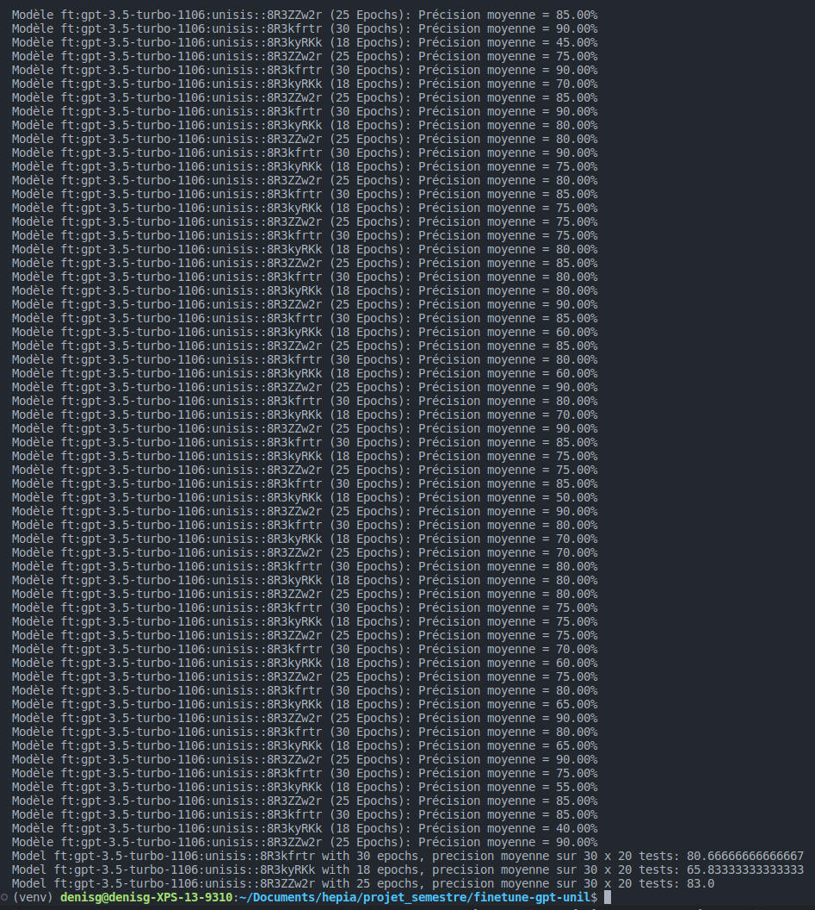

##### Moyenne des précisions sur 1200 questions

- 30 : 81.61
- 25 : 62.86
- 18 : 80.75

Nous pouvons remarquer que le modèle `ft:gpt-3.5-turbo-1106:unisis::8R3kfrtr` est le plus précis, mais pas de beaucoup.

### 5. Questions avec des triples quotes autour des nombres

```Tu es un data scientist. On te présente des données concernant les étudiants inscrits au semestre d’automne, par faculté selon le sexe. Les valeurs statistiques sont entre quotes.```

Pour tester cette méthode j'ai utilisé le même script que pour la partie précédente, et j'ai effectué 3 entrainements :

- 1er entrainement : 25 epochs
- 2ème entrainement : 18 epochs
- 3ème entrainement : 30 epochs

#### Résultats des questions avec des triples quotes autour des nombres

Pour tester cette partie j'ai utilisé le même script que pour la partie précédente, j'ai effectué 10 x 20 tests avec 18 epochs et 10 x 20 tests avec 25 epochs. Et j'ai aussi effectué 10 x 20 tests avec 30 epochs.

Exemple de commande pour lancer le script :

```bash
python3 test_precision_model_subproccess.py --limit 3 --times 10 --results logs/2023-12-01/results_test_triple_quotes.json --purpose "test de precision des modèles finetuner avec des triples quotes autour des chiffres" --system_message "Tu es un data scientist. On te présente des données concernant les étudiants inscrits au semestre d’automne, par faculté selon le sexe. Les valeurs statistiques sont entre quotes."
```
